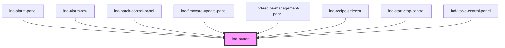

# ind-button

<!-- Auto Generated Below -->

## Properties

| Property          | Attribute            | Description                                                                                                                                                                                                    | Type                                            | Default     |
| ----------------- | -------------------- | -------------------------------------------------------------------------------------------------------------------------------------------------------------------------------------------------------------- | ----------------------------------------------- | ----------- |
| `disabled`        | `disabled`           | Disabled state.                                                                                                                                                                                                | `boolean`                                       | `false`     |
| `holdToConfirmMs` | `hold-to-confirm-ms` | If > 0, the button must be held this many milliseconds before activating. Use for critical actions (Stop, Trip, Reset) to prevent accidental clicks — standard NAMUR / safety-instrumented operating practice. | `number`                                        | `0`         |
| `label`           | `label`              | Optional accessible label (falls back to slotted text).                                                                                                                                                        | `string \| undefined`                           | `undefined` |
| `size`            | `size`               | Size.                                                                                                                                                                                                          | `"lg" \| "md" \| "sm"`                          | `'md'`      |
| `variant`         | `variant`            | Visual variant. `danger` should be paired with `holdToConfirmMs` for critical actions.                                                                                                                         | `"danger" \| "default" \| "ghost" \| "primary"` | `'default'` |

## Events

| Event         | Description                                                        | Type                |
| ------------- | ------------------------------------------------------------------ | ------------------- |
| `indActivate` | Fired on click (or after hold completes if `holdToConfirmMs > 0`). | `CustomEvent<void>` |

## Shadow Parts

| Part              | Description |
| ----------------- | ----------- |
| `"btn"`           |             |
| `"content"`       |             |
| `"hold-progress"` |             |

## Dependencies

### Used by

 - [ind-alarm-panel](../../organisms/alarm-panel)
 - [ind-alarm-row](../../molecules/alarm-row)
 - [ind-batch-control-panel](../../organisms/batch-control-panel)
 - [ind-firmware-update-panel](../../organisms/firmware-update-panel)
 - [ind-recipe-management-panel](../../organisms/recipe-management-panel)
 - [ind-recipe-selector](../../molecules/recipe-selector)
 - [ind-start-stop-control](../../molecules/start-stop-control)
 - [ind-valve-control-panel](../../organisms/valve-control-panel)

### Graph

----------------------------------------------

*Built with [StencilJS](https://stenciljs.com/)*
