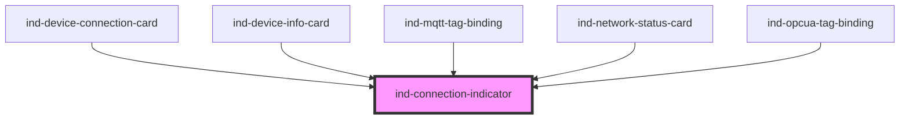

# ind-connection-indicator

<!-- Auto Generated Below -->

## Properties

| Property | Attribute | Description                                                       | Type                                                       | Default          |
| -------- | --------- | ----------------------------------------------------------------- | ---------------------------------------------------------- | ---------------- |
| `label`  | `label`   | Override the default text label. Pass an empty string to hide it. | `string \| undefined`                                      | `undefined`      |
| `size`   | `size`    | Size.                                                             | `"lg" \| "md" \| "sm"`                                     | `'md'`           |
| `state`  | `state`   | Connection state.                                                 | `"connected" \| "connecting" \| "disconnected" \| "error"` | `'disconnected'` |

## Shadow Parts

| Part      | Description |
| --------- | ----------- |
| `"dot"`   |             |
| `"label"` |             |

## Dependencies

### Used by

 - [ind-device-connection-card](../../molecules/device-connection-card)
 - [ind-device-info-card](../../molecules/device-info-card)
 - [ind-mqtt-tag-binding](../../molecules/mqtt-tag-binding)
 - [ind-network-status-card](../../molecules/network-status-card)
 - [ind-opcua-tag-binding](../../molecules/opcua-tag-binding)

### Graph

----------------------------------------------

*Built with [StencilJS](https://stenciljs.com/)*
