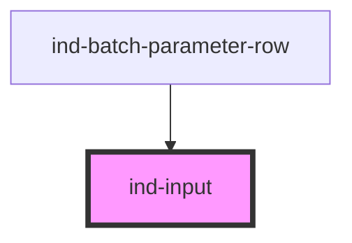

# ind-input

<!-- Auto Generated Below -->

## Properties

| Property       | Attribute      | Description                                                                                             | Type                                                                                               | Default     |
| -------------- | -------------- | ------------------------------------------------------------------------------------------------------- | -------------------------------------------------------------------------------------------------- | ----------- |
| `autocomplete` | `autocomplete` |                                                                                                         | `string \| undefined`                                                                              | `undefined` |
| `disabled`     | `disabled`     |                                                                                                         | `boolean`                                                                                          | `false`     |
| `invalid`      | `invalid`      |                                                                                                         | `boolean`                                                                                          | `false`     |
| `label`        | `label`        |                                                                                                         | `string \| undefined`                                                                              | `undefined` |
| `max`          | `max`          |                                                                                                         | `number \| string \| undefined`                                                                    | `undefined` |
| `min`          | `min`          |                                                                                                         | `number \| string \| undefined`                                                                    | `undefined` |
| `mode`         | `inputmode`    | Maps to the native `inputmode` attribute — named `mode` to avoid clashing with `HTMLElement.inputMode`. | `"decimal" \| "email" \| "none" \| "numeric" \| "search" \| "tel" \| "text" \| "url" \| undefined` | `undefined` |
| `name`         | `name`         |                                                                                                         | `string \| undefined`                                                                              | `undefined` |
| `pattern`      | `pattern`      |                                                                                                         | `string \| undefined`                                                                              | `undefined` |
| `placeholder`  | `placeholder`  |                                                                                                         | `string \| undefined`                                                                              | `undefined` |
| `readonly`     | `readonly`     |                                                                                                         | `boolean`                                                                                          | `false`     |
| `size`         | `size`         |                                                                                                         | `"lg" \| "md" \| "sm"`                                                                             | `'md'`      |
| `step`         | `step`         |                                                                                                         | `number \| string \| undefined`                                                                    | `undefined` |
| `type`         | `type`         |                                                                                                         | `"email" \| "number" \| "password" \| "search" \| "tel" \| "text" \| "url"`                        | `'text'`    |
| `value`        | `value`        |                                                                                                         | `string`                                                                                           | `''`        |

## Events

| Event       | Description                      | Type                  |
| ----------- | -------------------------------- | --------------------- |
| `indChange` | Fires on change (blur or Enter). | `CustomEvent<string>` |
| `indInput`  | Fires on every keystroke.        | `CustomEvent<string>` |

## Methods

### `setFocus() => Promise<void>`

Programmatically focus the underlying input.

#### Returns

Type: `Promise<void>`

## Shadow Parts

| Part      | Description |
| --------- | ----------- |
| `"field"` |             |
| `"input"` |             |
| `"label"` |             |
| `"wrap"`  |             |

## Dependencies

### Used by

 - [ind-batch-parameter-row](../../molecules/batch-parameter-row)

### Graph

----------------------------------------------

*Built with [StencilJS](https://stenciljs.com/)*
