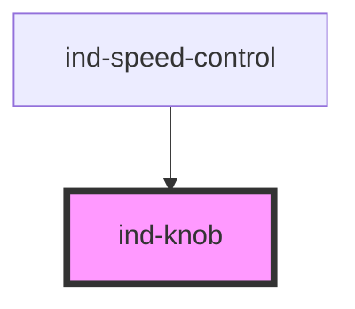

# ind-knob

<!-- Auto Generated Below -->

## Properties

| Property    | Attribute    | Description                            | Type                   | Default     |
| ----------- | ------------ | -------------------------------------- | ---------------------- | ----------- |
| `disabled`  | `disabled`   | Disabled.                              | `boolean`              | `false`     |
| `label`     | `label`      | Label.                                 | `string \| undefined`  | `undefined` |
| `max`       | `max`        | Maximum.                               | `number`               | `100`       |
| `min`       | `min`        | Minimum.                               | `number`               | `0`         |
| `showValue` | `show-value` | Show the numeric value below the knob. | `boolean`              | `true`      |
| `size`      | `size`       | Size.                                  | `"lg" \| "md" \| "sm"` | `'md'`      |
| `step`      | `step`       | Step for keyboard / drag.              | `number`               | `1`         |
| `unit`      | `unit`       | Unit suffix.                           | `string \| undefined`  | `undefined` |
| `value`     | `value`      | Current value.                         | `number`               | `0`         |

## Events

| Event       | Description                       | Type                  |
| ----------- | --------------------------------- | --------------------- |
| `indChange` | Fires on release.                 | `CustomEvent<number>` |
| `indInput`  | Fires continuously while turning. | `CustomEvent<number>` |

## Shadow Parts

| Part        | Description |
| ----------- | ----------- |
| `"caption"` |             |
| `"dial"`    |             |
| `"knob"`    |             |
| `"label"`   |             |
| `"pointer"` |             |
| `"value"`   |             |

## Dependencies

### Used by

 - [ind-speed-control](../../molecules/speed-control)

### Graph

----------------------------------------------

*Built with [StencilJS](https://stenciljs.com/)*
