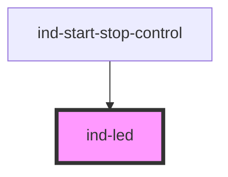

# ind-led

<!-- Auto Generated Below -->

## Properties

| Property   | Attribute  | Description                                                                                       | Type                                                              | Default     |
| ---------- | ---------- | ------------------------------------------------------------------------------------------------- | ----------------------------------------------------------------- | ----------- |
| `blinking` | `blinking` | Blink. For SCADA, fast blink = unacknowledged condition. Stops respecting prefers-reduced-motion. | `boolean`                                                         | `false`     |
| `label`    | `label`    | Optional visible label rendered next to the LED. Always becomes the accessible name.              | `string \| undefined`                                             | `undefined` |
| `size`     | `size`     | Visual size.                                                                                      | `"lg" \| "md" \| "sm"`                                            | `'md'`      |
| `state`    | `state`    | Process state driving the LED color and ARIA live politeness.                                     | `"fault" \| "maintenance" \| "running" \| "stopped" \| "warning"` | `'stopped'` |

## Shadow Parts

| Part      | Description |
| --------- | ----------- |
| `"label"` |             |
| `"led"`   |             |

## Dependencies

### Used by

 - [ind-start-stop-control](../../molecules/start-stop-control)

### Graph

----------------------------------------------

*Built with [StencilJS](https://stenciljs.com/)*
