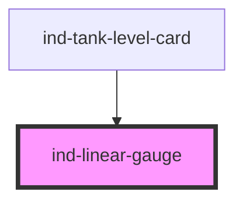

# ind-linear-gauge

<!-- Auto Generated Below -->

## Properties

| Property      | Attribute     | Description                                        | Type                         | Default        |
| ------------- | ------------- | -------------------------------------------------- | ---------------------------- | -------------- |
| `label`       | `label`       | Label.                                             | `string \| undefined`        | `undefined`    |
| `max`         | `max`         | Scale maximum.                                     | `number`                     | `100`          |
| `min`         | `min`         | Scale minimum.                                     | `number`                     | `0`            |
| `orientation` | `orientation` | Orientation.                                       | `"horizontal" \| "vertical"` | `'horizontal'` |
| `precision`   | `precision`   | Decimal places.                                    | `number \| undefined`        | `undefined`    |
| `setpoint`    | `setpoint`    | Optional setpoint marker.                          | `number \| undefined`        | `undefined`    |
| `showValue`   | `show-value`  | Show the numeric value.                            | `boolean`                    | `true`         |
| `size`        | `size`        | Size.                                              | `"lg" \| "md" \| "sm"`       | `'md'`         |
| `unit`        | `unit`        | Engineering unit.                                  | `string \| undefined`        | `undefined`    |
| `value`       | `value`       | Current value.                                     | `number`                     | `0`            |
| `zones`       | --            | Colored zones along the scale. Pass as a property. | `LinearGaugeZone[]`          | `[]`           |

## Shadow Parts

| Part         | Description |
| ------------ | ----------- |
| `"fill"`     |             |
| `"header"`   |             |
| `"label"`    |             |
| `"setpoint"` |             |
| `"track"`    |             |
| `"value"`    |             |

## Dependencies

### Used by

 - [ind-tank-level-card](../../molecules/tank-level-card)

### Graph

----------------------------------------------

*Built with [StencilJS](https://stenciljs.com/)*
