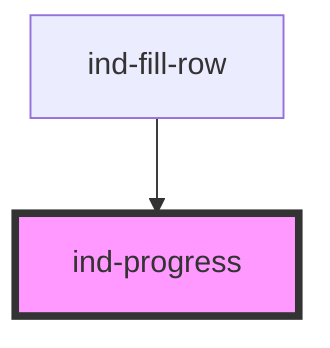

# ind-progress

<!-- Auto Generated Below -->

## Properties

| Property        | Attribute       | Description                                                             | Type                                             | Default     |
| --------------- | --------------- | ----------------------------------------------------------------------- | ------------------------------------------------ | ----------- |
| `indeterminate` | `indeterminate` | Indeterminate (animated bar, no value).                                 | `boolean`                                        | `false`     |
| `label`         | `label`         | Optional label rendered above the bar.                                  | `string \| undefined`                            | `undefined` |
| `max`           | `max`           | Max value.                                                              | `number`                                         | `100`       |
| `showValue`     | `show-value`    | Show numeric value next to the label.                                   | `boolean`                                        | `false`     |
| `size`          | `size`          | Size.                                                                   | `"lg" \| "md" \| "sm"`                           | `'md'`      |
| `unit`          | `unit`          | Unit suffix for the displayed value.                                    | `string \| undefined`                            | `undefined` |
| `value`         | `value`         | Current value (0–`max`).                                                | `number`                                         | `0`         |
| `variant`       | `variant`       | Visual variant. Use `warning` / `error` for low / critical fill levels. | `"default" \| "error" \| "success" \| "warning"` | `'default'` |

## Shadow Parts

| Part       | Description |
| ---------- | ----------- |
| `"fill"`   |             |
| `"header"` |             |
| `"label"`  |             |
| `"track"`  |             |
| `"value"`  |             |

## Dependencies

### Used by

 - [ind-fill-row](../../molecules/fill-row)

### Graph

----------------------------------------------

*Built with [StencilJS](https://stenciljs.com/)*
