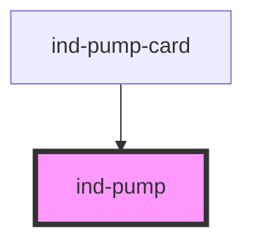

# ind-pump

<!-- Auto Generated Below -->

## Properties

| Property | Attribute | Description                                     | Type                                                              | Default     |
| -------- | --------- | ----------------------------------------------- | ----------------------------------------------------------------- | ----------- |
| `label`  | `label`   | Human label (e.g. "Feed pump").                 | `string \| undefined`                                             | `undefined` |
| `size`   | `size`    | Visual size.                                    | `"lg" \| "md" \| "sm"`                                            | `'md'`      |
| `state`  | `state`   | Process state. `running` animates the impeller. | `"fault" \| "maintenance" \| "running" \| "stopped" \| "warning"` | `'stopped'` |
| `tag`    | `tag`     | Equipment tag (e.g. "P-101").                   | `string \| undefined`                                             | `undefined` |

## Dependencies

### Used by

 - [ind-pump-card](../../molecules/pump-card)

### Graph

----------------------------------------------

*Built with [StencilJS](https://stenciljs.com/)*
