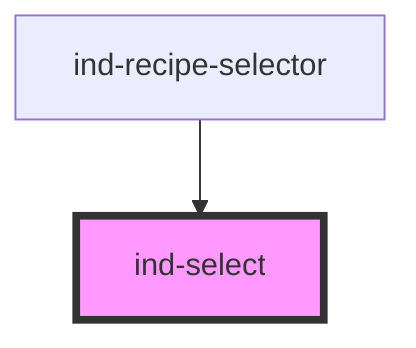

# ind-select

<!-- Auto Generated Below -->

## Properties

| Property      | Attribute     | Description                                                                                                                                                                                                   | Type                       | Default     |
| ------------- | ------------- | ------------------------------------------------------------------------------------------------------------------------------------------------------------------------------------------------------------- | -------------------------- | ----------- |
| `disabled`    | `disabled`    |                                                                                                                                                                                                               | `boolean`                  | `false`     |
| `invalid`     | `invalid`     |                                                                                                                                                                                                               | `boolean`                  | `false`     |
| `label`       | `label`       |                                                                                                                                                                                                               | `string \| undefined`      | `undefined` |
| `name`        | `name`        |                                                                                                                                                                                                               | `string \| undefined`      | `undefined` |
| `options`     | `options`     | Options. Pass an array via JS property (`.options = [...]`) OR a JSON-stringified array via the HTML `options` attribute. The native picker handles keyboard nav and mobile UI without us building a popover. | `SelectOption[] \| string` | `[]`        |
| `placeholder` | `placeholder` |                                                                                                                                                                                                               | `string \| undefined`      | `undefined` |
| `size`        | `size`        |                                                                                                                                                                                                               | `"lg" \| "md" \| "sm"`     | `'md'`      |
| `value`       | `value`       |                                                                                                                                                                                                               | `string`                   | `''`        |

## Events

| Event       | Description | Type                  |
| ----------- | ----------- | --------------------- |
| `indChange` |             | `CustomEvent<string>` |

## Shadow Parts

| Part       | Description |
| ---------- | ----------- |
| `"caret"`  |             |
| `"field"`  |             |
| `"label"`  |             |
| `"native"` |             |
| `"wrap"`   |             |

## Dependencies

### Used by

 - [ind-recipe-selector](../../molecules/recipe-selector)

### Graph

----------------------------------------------

*Built with [StencilJS](https://stenciljs.com/)*
