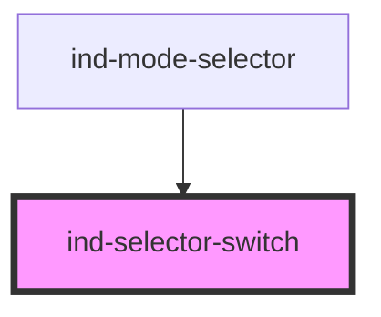

# ind-selector-switch

<!-- Auto Generated Below -->

## Properties

| Property    | Attribute  | Description                                                     | Type                  | Default     |
| ----------- | ---------- | --------------------------------------------------------------- | --------------------- | ----------- |
| `disabled`  | `disabled` | Disabled.                                                       | `boolean`             | `false`     |
| `label`     | `label`    | Group label.                                                    | `string \| undefined` | `undefined` |
| `positions` | --         | Discrete positions, e.g. OFF / HAND / AUTO. Pass as a property. | `SelectorPosition[]`  | `[]`        |
| `value`     | `value`    | Selected position value.                                        | `string \| undefined` | `undefined` |

## Events

| Event       | Description                        | Type                  |
| ----------- | ---------------------------------- | --------------------- |
| `indChange` | Fires when a position is selected. | `CustomEvent<string>` |

## Shadow Parts

| Part            | Description |
| --------------- | ----------- |
| `"group-label"` |             |
| `"position"`    |             |
| `"switch"`      |             |

## Dependencies

### Used by

 - [ind-mode-selector](../../molecules/mode-selector)

### Graph

----------------------------------------------

*Built with [StencilJS](https://stenciljs.com/)*
