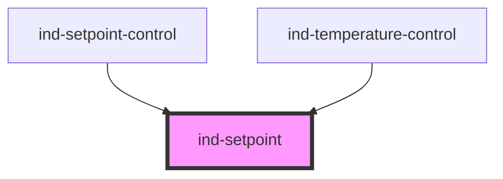

# ind-setpoint

<!-- Auto Generated Below -->

## Properties

| Property    | Attribute   | Description                                             | Type                   | Default     |
| ----------- | ----------- | ------------------------------------------------------- | ---------------------- | ----------- |
| `disabled`  | `disabled`  | Disabled.                                               | `boolean`              | `false`     |
| `label`     | `label`     | Label / tag.                                            | `string \| undefined`  | `undefined` |
| `max`       | `max`       | Maximum.                                                | `number \| undefined`  | `undefined` |
| `min`       | `min`       | Minimum.                                                | `number \| undefined`  | `undefined` |
| `precision` | `precision` | Decimal places to display.                              | `number \| undefined`  | `undefined` |
| `pv`        | `pv`        | Live process value, shown for comparison when provided. | `number \| undefined`  | `undefined` |
| `size`      | `size`      | Size.                                                   | `"lg" \| "md" \| "sm"` | `'md'`      |
| `step`      | `step`      | Step for the +/- buttons and keyboard.                  | `number`               | `1`         |
| `unit`      | `unit`      | Engineering unit.                                       | `string \| undefined`  | `undefined` |
| `value`     | `value`     | Target setpoint value (editable).                       | `number`               | `0`         |

## Events

| Event       | Description                           | Type                  |
| ----------- | ------------------------------------- | --------------------- |
| `indChange` | Fires when the setpoint is committed. | `CustomEvent<number>` |

## Shadow Parts

| Part      | Description |
| --------- | ----------- |
| `"dec"`   |             |
| `"frame"` |             |
| `"inc"`   |             |
| `"input"` |             |
| `"label"` |             |
| `"pv"`    |             |
| `"rows"`  |             |
| `"sp"`    |             |

## Dependencies

### Used by

 - [ind-setpoint-control](../../molecules/setpoint-control)
 - [ind-temperature-control](../../molecules/temperature-control)

### Graph

----------------------------------------------

*Built with [StencilJS](https://stenciljs.com/)*
