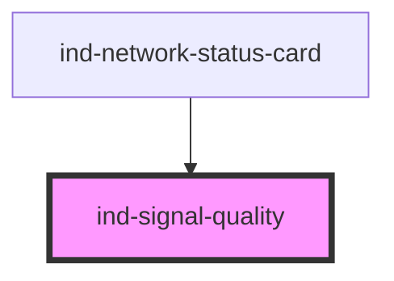

# ind-signal-quality

<!-- Auto Generated Below -->

## Properties

| Property | Attribute | Description                               | Type                   | Default     |
| -------- | --------- | ----------------------------------------- | ---------------------- | ----------- |
| `bars`   | `bars`    | Total bars.                               | `number`               | `4`         |
| `label`  | `label`   | Optional label rendered next to the bars. | `string \| undefined`  | `undefined` |
| `level`  | `level`   | Number of filled bars.                    | `number`               | `0`         |
| `size`   | `size`    | Size.                                     | `"lg" \| "md" \| "sm"` | `'md'`      |

## Shadow Parts

| Part      | Description |
| --------- | ----------- |
| `"bars"`  |             |
| `"label"` |             |

## Dependencies

### Used by

 - [ind-network-status-card](../../molecules/network-status-card)

### Graph

----------------------------------------------

*Built with [StencilJS](https://stenciljs.com/)*
