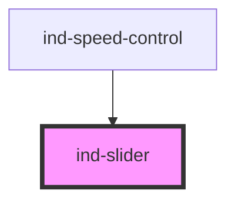

# ind-slider

<!-- Auto Generated Below -->

## Properties

| Property    | Attribute    | Description                               | Type                   | Default     |
| ----------- | ------------ | ----------------------------------------- | ---------------------- | ----------- |
| `disabled`  | `disabled`   | Disabled.                                 | `boolean`              | `false`     |
| `label`     | `label`      | Visible label.                            | `string \| undefined`  | `undefined` |
| `max`       | `max`        | Maximum.                                  | `number`               | `100`       |
| `min`       | `min`        | Minimum.                                  | `number`               | `0`         |
| `showValue` | `show-value` | Show the current value next to the label. | `boolean`              | `true`      |
| `size`      | `size`       | Size.                                     | `"lg" \| "md" \| "sm"` | `'md'`      |
| `step`      | `step`       | Step.                                     | `number`               | `1`         |
| `unit`      | `unit`       | Unit suffix shown with the value.         | `string \| undefined`  | `undefined` |
| `value`     | `value`      | Current value.                            | `number`               | `0`         |

## Events

| Event       | Description                            | Type                  |
| ----------- | -------------------------------------- | --------------------- |
| `indChange` | Fires on commit (mouse up / keyboard). | `CustomEvent<number>` |
| `indInput`  | Fires on every change while dragging.  | `CustomEvent<number>` |

## Shadow Parts

| Part       | Description |
| ---------- | ----------- |
| `"header"` |             |
| `"label"`  |             |
| `"range"`  |             |
| `"value"`  |             |

## Dependencies

### Used by

 - [ind-speed-control](../../molecules/speed-control)

### Graph

----------------------------------------------

*Built with [StencilJS](https://stenciljs.com/)*
