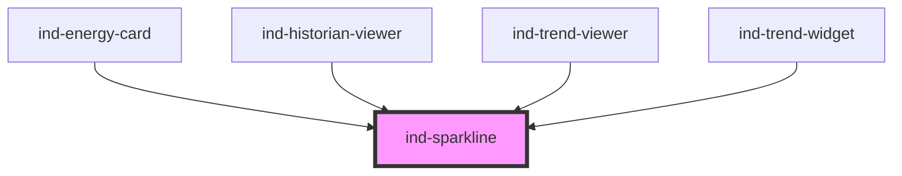

# ind-sparkline

<!-- Auto Generated Below -->

## Properties

| Property  | Attribute | Description                                                     | Type                                             | Default     |
| --------- | --------- | --------------------------------------------------------------- | ------------------------------------------------ | ----------- |
| `area`    | `area`    | Fill the area under the line.                                   | `boolean`                                        | `false`     |
| `label`   | `label`   | Accessible label.                                               | `string \| undefined`                            | `undefined` |
| `marker`  | `marker`  | Highlight the most recent sample with a dot.                    | `boolean`                                        | `true`      |
| `max`     | `max`     | Upper bound. Defaults to the max of `points`.                   | `number \| undefined`                            | `undefined` |
| `min`     | `min`     | Lower bound. Defaults to the min of `points`.                   | `number \| undefined`                            | `undefined` |
| `points`  | --        | Series of numeric samples, oldest → newest. Pass as a property. | `number[]`                                       | `[]`        |
| `variant` | `variant` | Color intent.                                                   | `"default" \| "fault" \| "running" \| "warning"` | `'default'` |

## Shadow Parts

| Part      | Description |
| --------- | ----------- |
| `"chart"` |             |
| `"dot"`   |             |
| `"fill"`  |             |
| `"line"`  |             |

## Dependencies

### Used by

 - [ind-energy-card](../../molecules/energy-card)
 - [ind-historian-viewer](../../organisms/historian-viewer)
 - [ind-trend-viewer](../../organisms/trend-viewer)
 - [ind-trend-widget](../../molecules/trend-widget)

### Graph

----------------------------------------------

*Built with [StencilJS](https://stenciljs.com/)*
