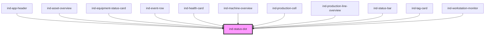

# ind-status-dot

<!-- Auto Generated Below -->

## Properties

| Property   | Attribute  | Description                                                                                                                                 | Type                                                                                                             | Default     |
| ---------- | ---------- | ------------------------------------------------------------------------------------------------------------------------------------------- | ---------------------------------------------------------------------------------------------------------------- | ----------- |
| `blinking` | `blinking` |                                                                                                                                             | `boolean`                                                                                                        | `false`     |
| `label`    | `label`    | Optional accessible name. Set when the dot stands alone; leave undefined when it's paired with adjacent text that already names the status. | `string \| undefined`                                                                                            | `undefined` |
| `size`     | `size`     |                                                                                                                                             | `"lg" \| "md" \| "sm"`                                                                                           | `'md'`      |
| `state`    | `state`    |                                                                                                                                             | `"error" \| "fault" \| "info" \| "maintenance" \| "neutral" \| "running" \| "stopped" \| "success" \| "warning"` | `'neutral'` |

## Dependencies

### Used by

 - [ind-app-header](../../organisms/app-header)
 - [ind-asset-overview](../../organisms/asset-overview)
 - [ind-equipment-status-card](../../molecules/equipment-status-card)
 - [ind-event-row](../../molecules/event-row)
 - [ind-health-card](../../molecules/health-card)
 - [ind-machine-overview](../../organisms/machine-overview)
 - [ind-production-cell](../../organisms/production-cell)
 - [ind-production-line-overview](../../organisms/production-line-overview)
 - [ind-status-bar](../../organisms/status-bar)
 - [ind-tag-card](../../molecules/tag-card)
 - [ind-workstation-monitor](../../organisms/workstation-monitor)

### Graph

----------------------------------------------

*Built with [StencilJS](https://stenciljs.com/)*
