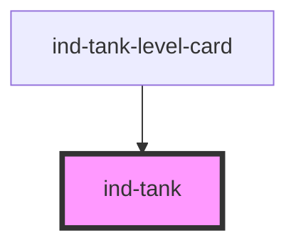

# ind-tank

<!-- Auto Generated Below -->

## Properties

| Property    | Attribute    | Description                                                    | Type                                                              | Default     |
| ----------- | ------------ | -------------------------------------------------------------- | ----------------------------------------------------------------- | ----------- |
| `alarm`     | `alarm`      | Alarm tint of the liquid (overrides state-derived fill color). | `"high" \| "low" \| "none"`                                       | `'none'`    |
| `label`     | `label`      | Human label.                                                   | `string \| undefined`                                             | `undefined` |
| `level`     | `level`      | Fill level, 0–100 %.                                           | `number`                                                          | `0`         |
| `showValue` | `show-value` | Show the numeric level under the symbol.                       | `boolean`                                                         | `false`     |
| `size`      | `size`       | Visual size.                                                   | `"lg" \| "md" \| "sm"`                                            | `'md'`      |
| `state`     | `state`      | Process state (drives outline color).                          | `"fault" \| "maintenance" \| "running" \| "stopped" \| "warning"` | `'stopped'` |
| `tag`       | `tag`        | Equipment tag (e.g. "T-204").                                  | `string \| undefined`                                             | `undefined` |

## Dependencies

### Used by

 - [ind-tank-level-card](../../molecules/tank-level-card)

### Graph

----------------------------------------------

*Built with [StencilJS](https://stenciljs.com/)*
