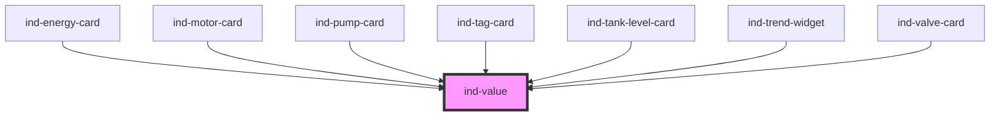

# ind-value

<!-- Auto Generated Below -->

## Properties

| Property             | Attribute   | Description                                                              | Type                                                    | Default     |
| -------------------- | ----------- | ------------------------------------------------------------------------ | ------------------------------------------------------- | ----------- |
| `alarm`              | `alarm`     | Active alarm priority. Highlights the readout with the ISA-18.2 color.   | `"high" \| "high-high" \| "low" \| "low-low" \| "none"` | `'none'`    |
| `label`              | `label`     | Human label shown above the number (e.g. "Discharge pressure").          | `string \| undefined`                                   | `undefined` |
| `precision`          | `precision` | Decimal places when `value` is numeric. Default: as-is.                  | `number \| undefined`                                   | `undefined` |
| `size`               | `size`      | Readout size — `lg` is appropriate for primary KPIs (uses the 3xl font). | `"lg" \| "md" \| "sm"`                                  | `'md'`      |
| `tag`                | `tag`       | Equipment tag shown above the number (e.g. "PT-101").                    | `string \| undefined`                                   | `undefined` |
| `trend`              | `trend`     | Process trend direction. Renders a small arrow next to the unit.         | `"down" \| "none" \| "stable" \| "up"`                  | `'none'`    |
| `unit`               | `unit`      | Engineering unit shown after the number (e.g. "bar", "°C", "m³/h").      | `string \| undefined`                                   | `undefined` |
| `value` _(required)_ | `value`     | Raw value to display. Numeric values are formatted with `precision`.     | `number \| string`                                      | `undefined` |

## Shadow Parts

| Part        | Description |
| ----------- | ----------- |
| `"header"`  |             |
| `"label"`   |             |
| `"number"`  |             |
| `"readout"` |             |
| `"tag"`     |             |
| `"trend"`   |             |
| `"unit"`    |             |

## Dependencies

### Used by

 - [ind-energy-card](../../molecules/energy-card)
 - [ind-motor-card](../../molecules/motor-card)
 - [ind-pump-card](../../molecules/pump-card)
 - [ind-tag-card](../../molecules/tag-card)
 - [ind-tank-level-card](../../molecules/tank-level-card)
 - [ind-trend-widget](../../molecules/trend-widget)
 - [ind-valve-card](../../molecules/valve-card)

### Graph

----------------------------------------------

*Built with [StencilJS](https://stenciljs.com/)*
