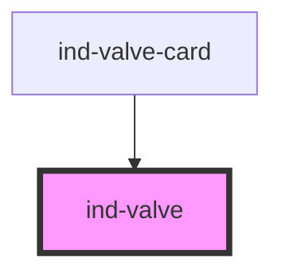

# ind-valve

<!-- Auto Generated Below -->

## Properties

| Property      | Attribute     | Description                                                                   | Type                                         | Default        |
| ------------- | ------------- | ----------------------------------------------------------------------------- | -------------------------------------------- | -------------- |
| `label`       | `label`       | Human label rendered as caption (e.g. "Discharge valve").                     | `string \| undefined`                        | `undefined`    |
| `orientation` | `orientation` | Render the symbol along the flow direction.                                   | `"horizontal" \| "vertical"`                 | `'horizontal'` |
| `size`        | `size`        | Visual size.                                                                  | `"lg" \| "md" \| "sm"`                       | `'md'`         |
| `state`       | `state`       | Valve state. `transit` is mid-stroke (transitioning between open and closed). | `"closed" \| "fault" \| "open" \| "transit"` | `'closed'`     |
| `tag`         | `tag`         | Equipment tag rendered as caption (e.g. "V-12").                              | `string \| undefined`                        | `undefined`    |

## Shadow Parts

| Part        | Description |
| ----------- | ----------- |
| `"caption"` |             |
| `"label"`   |             |
| `"left"`    |             |
| `"right"`   |             |
| `"stem"`    |             |
| `"symbol"`  |             |
| `"tag"`     |             |

## Dependencies

### Used by

 - [ind-valve-card](../../molecules/valve-card)

### Graph

----------------------------------------------

*Built with [StencilJS](https://stenciljs.com/)*
