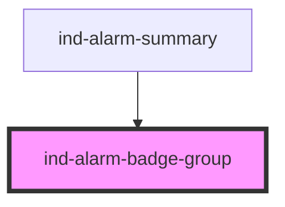

# ind-alarm-badge-group

<!-- Auto Generated Below -->

## Overview

Row of ISA-18.2 priority counters (HH / H / L / LL). Gives an at-a-glance
alarm summary for a unit or the whole plant, colored by priority.

## Properties

| Property    | Attribute    | Description                          | Type      | Default |
| ----------- | ------------ | ------------------------------------ | --------- | ------- |
| `hideZero`  | `hide-zero`  | Hide priorities whose count is zero. | `boolean` | `false` |
| `high`      | `high`       | High count.                          | `number`  | `0`     |
| `highHigh`  | `high-high`  | High-high count.                     | `number`  | `0`     |
| `low`       | `low`        | Low count.                           | `number`  | `0`     |
| `lowLow`    | `low-low`    | Low-low count.                       | `number`  | `0`     |
| `showTotal` | `show-total` | Append a total pill.                 | `boolean` | `false` |

## Shadow Parts

| Part           | Description |
| -------------- | ----------- |
| `"pill"`       |             |
| `"pill-count"` |             |
| `"pill-label"` |             |
| `"total"`      |             |

## Dependencies

### Used by

 - [ind-alarm-summary](../../organisms/alarm-summary)

### Graph

----------------------------------------------

*Built with [StencilJS](https://stenciljs.com/)*
