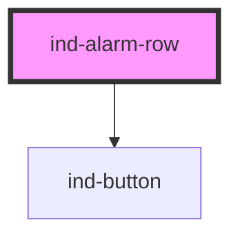

# ind-alarm-row

<!-- Auto Generated Below -->

## Overview

One line in an alarm summary / list. Shows the ISA-18.2 priority, the tag,
the message, a timestamp and an acknowledge button. Emits `indAck`.

## Properties

| Property               | Attribute      | Description                                                 | Type                                          | Default     |
| ---------------------- | -------------- | ----------------------------------------------------------- | --------------------------------------------- | ----------- |
| `acknowledged`         | `acknowledged` | Acknowledged state — dims the row and hides the ack button. | `boolean`                                     | `false`     |
| `message` _(required)_ | `message`      | Alarm message.                                              | `string`                                      | `undefined` |
| `priority`             | `priority`     | Alarm priority.                                             | `"high" \| "high-high" \| "low" \| "low-low"` | `'high'`    |
| `tag`                  | `tag`          | Source tag (e.g. "PT-101").                                 | `string \| undefined`                         | `undefined` |
| `time`                 | `time`         | Pre-formatted timestamp string.                             | `string \| undefined`                         | `undefined` |

## Events

| Event    | Description                                      | Type                |
| -------- | ------------------------------------------------ | ------------------- |
| `indAck` | Fires when the operator acknowledges this alarm. | `CustomEvent<void>` |

## Shadow Parts

| Part         | Description |
| ------------ | ----------- |
| `"ack"`      |             |
| `"acked"`    |             |
| `"message"`  |             |
| `"priority"` |             |
| `"tag"`      |             |
| `"time"`     |             |

## Dependencies

### Depends on

- [ind-button](../../atoms/button)

### Graph

----------------------------------------------

*Built with [StencilJS](https://stenciljs.com/)*
