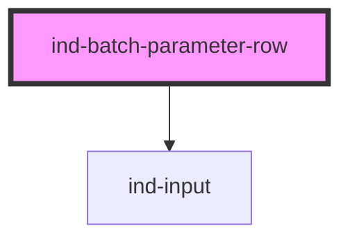

# ind-batch-parameter-row

<!-- Auto Generated Below -->

## Overview

One editable parameter in a batch / recipe parameter list: label, value
input, unit suffix and an optional target hint. Designed to stack inside a
scrolling parameter table.

## Properties

| Property             | Attribute     | Description                                           | Type                            | Default     |
| -------------------- | ------------- | ----------------------------------------------------- | ------------------------------- | ----------- |
| `disabled`           | `disabled`    |                                                       | `boolean`                       | `false`     |
| `invalid`            | `invalid`     | Mark the row as out of range / invalid.               | `boolean`                       | `false`     |
| `label` _(required)_ | `label`       | Parameter name (e.g. "Dose volume").                  | `string`                        | `undefined` |
| `max`                | `max`         |                                                       | `number \| undefined`           | `undefined` |
| `min`                | `min`         |                                                       | `number \| undefined`           | `undefined` |
| `placeholder`        | `placeholder` |                                                       | `string \| undefined`           | `undefined` |
| `step`               | `step`        |                                                       | `number \| undefined`           | `undefined` |
| `target`             | `target`      | Read-only target / default hint shown after the unit. | `string \| undefined`           | `undefined` |
| `type`               | `type`        | Input type.                                           | `string`                        | `'number'`  |
| `unit`               | `unit`        | Engineering unit.                                     | `string \| undefined`           | `undefined` |
| `value`              | `value`       | Current value (two-way).                              | `number \| string \| undefined` | `undefined` |

## Events

| Event       | Description                       | Type                  |
| ----------- | --------------------------------- | --------------------- |
| `indChange` | Committed value.                  | `CustomEvent<string>` |
| `indInput`  | Live value as the operator types. | `CustomEvent<string>` |

## Shadow Parts

| Part       | Description |
| ---------- | ----------- |
| `"field"`  |             |
| `"label"`  |             |
| `"target"` |             |
| `"unit"`   |             |

## Dependencies

### Depends on

- [ind-input](../../atoms/input)

### Graph

----------------------------------------------

*Built with [StencilJS](https://stenciljs.com/)*
