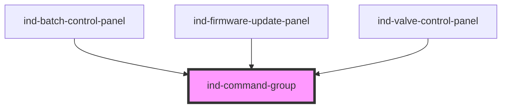

# ind-command-group

<!-- Auto Generated Below -->

## Overview

Groups related command buttons into a single segmented bar with a shared
border. Slot `<ind-button>`s into the default slot. Purely presentational —
each button keeps its own `indActivate` event.

## Properties

| Property      | Attribute     | Description                                                 | Type                         | Default        |
| ------------- | ------------- | ----------------------------------------------------------- | ---------------------------- | -------------- |
| `attached`    | `attached`    | Render attached (shared borders, no gap) instead of spaced. | `boolean`                    | `false`        |
| `label`       | `label`       | Accessible label for the toolbar group.                     | `string \| undefined`        | `undefined`    |
| `orientation` | `orientation` | Layout direction.                                           | `"horizontal" \| "vertical"` | `'horizontal'` |

## Dependencies

### Used by

 - [ind-batch-control-panel](../../organisms/batch-control-panel)
 - [ind-firmware-update-panel](../../organisms/firmware-update-panel)
 - [ind-valve-control-panel](../../organisms/valve-control-panel)

### Graph

----------------------------------------------

*Built with [StencilJS](https://stenciljs.com/)*
