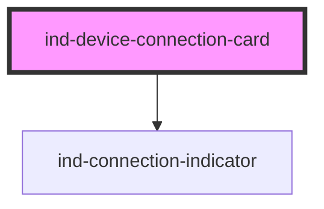

# ind-device-connection-card

<!-- Auto Generated Below -->

## Overview

Connection summary for a field device / driver: protocol, endpoint, live
connection state and round-trip latency.

## Properties

| Property            | Attribute  | Description                                               | Type                                                       | Default          |
| ------------------- | ---------- | --------------------------------------------------------- | ---------------------------------------------------------- | ---------------- |
| `endpoint`          | `endpoint` | Endpoint (host:port / URL).                               | `string \| undefined`                                      | `undefined`      |
| `latency`           | `latency`  | Round-trip latency in ms.                                 | `number \| undefined`                                      | `undefined`      |
| `name` _(required)_ | `name`     | Device / driver name.                                     | `string`                                                   | `undefined`      |
| `protocol`          | `protocol` | Protocol (e.g. "Modbus TCP", "EtherNet/IP").              | `string \| undefined`                                      | `undefined`      |
| `state`             | `state`    | Connection state — drives the indicator and fault chrome. | `"connected" \| "connecting" \| "disconnected" \| "error"` | `'disconnected'` |

## Shadow Parts

| Part         | Description |
| ------------ | ----------- |
| `"endpoint"` |             |
| `"latency"`  |             |
| `"name"`     |             |
| `"protocol"` |             |

## Dependencies

### Depends on

- [ind-connection-indicator](../../atoms/connection-indicator)

### Graph

----------------------------------------------

*Built with [StencilJS](https://stenciljs.com/)*
