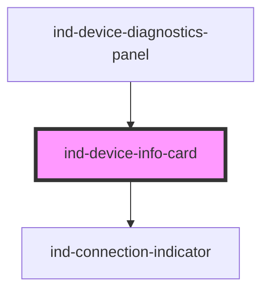

# ind-device-info-card

<!-- Auto Generated Below -->

## Overview

Device nameplate card: identity metadata (vendor, model, firmware, serial,
address) plus a live connection indicator. For a device detail panel.

## Properties

| Property            | Attribute  | Description                      | Type                                                       | Default          |
| ------------------- | ---------- | -------------------------------- | ---------------------------------------------------------- | ---------------- |
| `address`           | `address`  | Network address (IP / endpoint). | `string \| undefined`                                      | `undefined`      |
| `firmware`          | `firmware` | Firmware / software version.     | `string \| undefined`                                      | `undefined`      |
| `model`             | `model`    | Model number.                    | `string \| undefined`                                      | `undefined`      |
| `name` _(required)_ | `name`     | Device name (e.g. "Line 2 PLC"). | `string`                                                   | `undefined`      |
| `serial`            | `serial`   | Serial number.                   | `string \| undefined`                                      | `undefined`      |
| `state`             | `state`    | Connection state.                | `"connected" \| "connecting" \| "disconnected" \| "error"` | `'disconnected'` |
| `vendor`            | `vendor`   | Manufacturer.                    | `string \| undefined`                                      | `undefined`      |

## Shadow Parts

| Part     | Description |
| -------- | ----------- |
| `"dd"`   |             |
| `"dt"`   |             |
| `"meta"` |             |
| `"name"` |             |

## Dependencies

### Used by

 - [ind-device-diagnostics-panel](../../organisms/device-diagnostics-panel)

### Depends on

- [ind-connection-indicator](../../atoms/connection-indicator)

### Graph

----------------------------------------------

*Built with [StencilJS](https://stenciljs.com/)*
