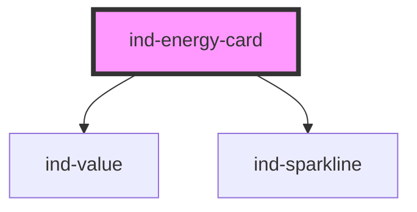

# ind-energy-card

<!-- Auto Generated Below -->

## Overview

Energy / power KPI card: a headline reading plus an `<ind-sparkline>` for the
recent profile and an optional cumulative figure for the period.

## Properties

| Property             | Attribute    | Description                                        | Type                                 | Default     |
| -------------------- | ------------ | -------------------------------------------------- | ------------------------------------ | ----------- |
| `label` _(required)_ | `label`      | Metric name (e.g. "Active power", "Energy today"). | `string`                             | `undefined` |
| `points`             | --           | Recent samples for the sparkline.                  | `number[]`                           | `[]`        |
| `precision`          | `precision`  | Decimal places.                                    | `number`                             | `1`         |
| `total`              | `total`      | Cumulative value for the period (e.g. kWh today).  | `number \| undefined`                | `undefined` |
| `totalUnit`          | `total-unit` | Cumulative unit (default kWh).                     | `string`                             | `'kWh'`     |
| `trend`              | `trend`      | Trend arrow.                                       | `"down" \| "flat" \| "none" \| "up"` | `'none'`    |
| `unit`               | `unit`       | Unit (default kW).                                 | `string`                             | `'kW'`      |
| `value` _(required)_ | `value`      | Instantaneous value.                               | `number`                             | `undefined` |

## Shadow Parts

| Part      | Description |
| --------- | ----------- |
| `"arrow"` |             |
| `"label"` |             |
| `"spark"` |             |
| `"total"` |             |
| `"value"` |             |

## Dependencies

### Depends on

- [ind-value](../../atoms/value)
- [ind-sparkline](../../atoms/sparkline)

### Graph

----------------------------------------------

*Built with [StencilJS](https://stenciljs.com/)*
