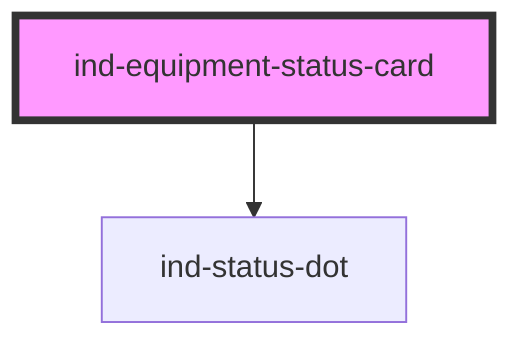

# ind-equipment-status-card

<!-- Auto Generated Below -->

## Overview

Generic equipment status card. Slot a process symbol (`<ind-pump>`,
`<ind-motor>`, …) into the default slot; the card supplies the heading,
a state badge and an optional detail line.

## Properties

| Property               | Attribute     | Description                                              | Type                                                                           | Default     |
| ---------------------- | ------------- | -------------------------------------------------------- | ------------------------------------------------------------------------------ | ----------- |
| `detail`               | `detail`      | Sub-line for context (runtime, last fault, …).           | `string \| undefined`                                                          | `undefined` |
| `heading` _(required)_ | `heading`     | Equipment name (e.g. "Feed pump").                       | `string`                                                                       | `undefined` |
| `state`                | `state`       | Process state — drives the badge color and fault chrome. | `"fault" \| "maintenance" \| "running" \| "stopped" \| "unknown" \| "warning"` | `'unknown'` |
| `stateLabel`           | `state-label` | Override the default state label.                        | `string \| undefined`                                                          | `undefined` |
| `tag`                  | `tag`         | Equipment tag (e.g. "P-101").                            | `string \| undefined`                                                          | `undefined` |

## Shadow Parts

| Part            | Description |
| --------------- | ----------- |
| `"body"`        |             |
| `"detail"`      |             |
| `"heading"`     |             |
| `"state-label"` |             |
| `"status"`      |             |
| `"symbol"`      |             |
| `"tag"`         |             |

## Dependencies

### Depends on

- [ind-status-dot](../../atoms/status-dot)

### Graph

----------------------------------------------

*Built with [StencilJS](https://stenciljs.com/)*
