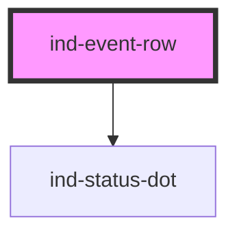

# ind-event-row

<!-- Auto Generated Below -->

## Overview

One line in an event / system log: timestamp, severity dot, source and
message. Read-only.

## Properties

| Property               | Attribute  | Description                             | Type                                          | Default     |
| ---------------------- | ---------- | --------------------------------------- | --------------------------------------------- | ----------- |
| `message` _(required)_ | `message`  | Event message.                          | `string`                                      | `undefined` |
| `severity`             | `severity` | Severity — drives the status dot color. | `"error" \| "info" \| "success" \| "warning"` | `'info'`    |
| `source`               | `source`   | Event source (subsystem, device, tag).  | `string \| undefined`                         | `undefined` |
| `time`                 | `time`     | Pre-formatted timestamp.                | `string \| undefined`                         | `undefined` |

## Shadow Parts

| Part        | Description |
| ----------- | ----------- |
| `"message"` |             |
| `"source"`  |             |
| `"time"`    |             |

## Dependencies

### Depends on

- [ind-status-dot](../../atoms/status-dot)

### Graph

----------------------------------------------

*Built with [StencilJS](https://stenciljs.com/)*
