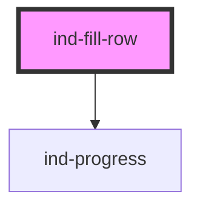

# ind-fill-row

<!-- Auto Generated Below -->

## Properties

| Property             | Attribute  | Description                                                  | Type                                             | Default     |
| -------------------- | ---------- | ------------------------------------------------------------ | ------------------------------------------------ | ----------- |
| `label` _(required)_ | `label`    | Human description.                                           | `string`                                         | `undefined` |
| `max`                | `max`      | Max value. Default 100.                                      | `number`                                         | `100`       |
| `severity`           | `severity` | Render the severity glyph between the value and the actions. | `boolean`                                        | `false`     |
| `tag`                | `tag`      | Short ID rendered in mono (e.g. "F1", "TK-101").             | `string \| undefined`                            | `undefined` |
| `unit`               | `unit`     | Unit suffix on the numeric value (default `%`).              | `string`                                         | `'%'`       |
| `value`              | `value`    | Current level.                                               | `number`                                         | `0`         |
| `variant`            | `variant`  | Drives the progress color and the severity glyph.            | `"default" \| "error" \| "success" \| "warning"` | `'default'` |

## Shadow Parts

| Part         | Description |
| ------------ | ----------- |
| `"actions"`  |             |
| `"label"`    |             |
| `"progress"` |             |
| `"severity"` |             |
| `"tag"`      |             |
| `"value"`    |             |

## Dependencies

### Depends on

- [ind-progress](../../atoms/progress)

### Graph

----------------------------------------------

*Built with [StencilJS](https://stenciljs.com/)*
