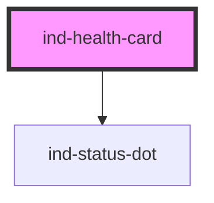

# ind-health-card

<!-- Auto Generated Below -->

## Properties

| Property               | Attribute     | Description                                                        | Type                                                                           | Default     |
| ---------------------- | ------------- | ------------------------------------------------------------------ | ------------------------------------------------------------------------------ | ----------- |
| `detail`               | `detail`      | Optional sub-line for context (timestamp, last error, etc.).       | `string \| undefined`                                                          | `undefined` |
| `heading` _(required)_ | `heading`     | Subsystem name (e.g. "PLC", "Dispense robot", "Washer").           | `string`                                                                       | `undefined` |
| `state`                | `state`       | Process state — drives the dot color and the prominent text color. | `"fault" \| "maintenance" \| "running" \| "stopped" \| "unknown" \| "warning"` | `'unknown'` |
| `stateLabel`           | `state-label` | Override the default label (e.g. show "RUN 24 h" instead of "OK"). | `string \| undefined`                                                          | `undefined` |

## Shadow Parts

| Part            | Description |
| --------------- | ----------- |
| `"detail"`      |             |
| `"state-label"` |             |
| `"status"`      |             |
| `"title"`       |             |

## Dependencies

### Depends on

- [ind-status-dot](../../atoms/status-dot)

### Graph

----------------------------------------------

*Built with [StencilJS](https://stenciljs.com/)*
