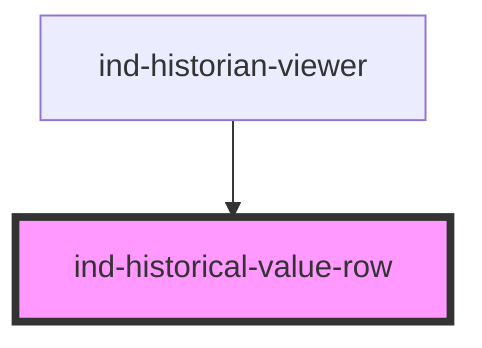

# ind-historical-value-row

<!-- Auto Generated Below -->

## Overview

One sample in a historical / trend table: timestamp, value with unit and an
OPC-style data quality flag. Read-only.

## Properties

| Property             | Attribute   | Description                  | Type                             | Default     |
| -------------------- | ----------- | ---------------------------- | -------------------------------- | ----------- |
| `precision`          | `precision` | Decimal places when numeric. | `number \| undefined`            | `undefined` |
| `quality`            | `quality`   | Data quality flag.           | `"bad" \| "good" \| "uncertain"` | `'good'`    |
| `time` _(required)_  | `time`      | Pre-formatted timestamp.     | `string`                         | `undefined` |
| `unit`               | `unit`      | Engineering unit.            | `string \| undefined`            | `undefined` |
| `value` _(required)_ | `value`     | Sample value.                | `number \| string`               | `undefined` |

## Shadow Parts

| Part        | Description |
| ----------- | ----------- |
| `"quality"` |             |
| `"time"`    |             |
| `"unit"`    |             |
| `"value"`   |             |

## Dependencies

### Used by

 - [ind-historian-viewer](../../organisms/historian-viewer)

### Graph

----------------------------------------------

*Built with [StencilJS](https://stenciljs.com/)*
