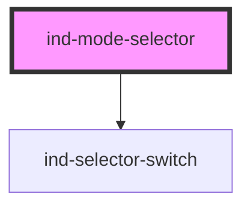

# ind-mode-selector

<!-- Auto Generated Below -->

## Overview

Operating-mode selector (Off / Manual / Auto by default). A labelled wrapper
around `<ind-selector-switch>` that re-emits the chosen mode.

## Properties

| Property    | Attribute  | Description                   | Type                  | Default                                                                                                             |
| ----------- | ---------- | ----------------------------- | --------------------- | ------------------------------------------------------------------------------------------------------------------- |
| `disabled`  | `disabled` |                               | `boolean`             | `false`                                                                                                             |
| `label`     | `label`    | Control label.                | `string`              | `'Mode'`                                                                                                            |
| `positions` | --         | Selectable positions.         | `SelectorPosition[]`  | `[   { value: 'off', label: 'Off' },   { value: 'manual', label: 'Manual' },   { value: 'auto', label: 'Auto' }, ]` |
| `value`     | `value`    | Current mode value (two-way). | `string \| undefined` | `undefined`                                                                                                         |

## Events

| Event       | Description                         | Type                  |
| ----------- | ----------------------------------- | --------------------- |
| `indChange` | Fires with the selected mode value. | `CustomEvent<string>` |

## Shadow Parts

| Part       | Description |
| ---------- | ----------- |
| `"label"`  |             |
| `"switch"` |             |

## Dependencies

### Depends on

- [ind-selector-switch](../../atoms/selector-switch)

### Graph

----------------------------------------------

*Built with [StencilJS](https://stenciljs.com/)*
