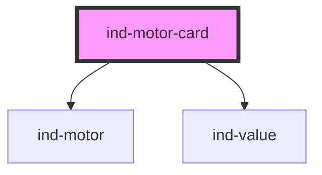

# ind-motor-card

<!-- Auto Generated Below -->

## Overview

Motor faceplate: animated `<ind-motor>` symbol plus speed / current / load
readouts. Drop into an equipment overview grid.

## Properties

| Property  | Attribute | Description                                                         | Type                                                              | Default     |
| --------- | --------- | ------------------------------------------------------------------- | ----------------------------------------------------------------- | ----------- |
| `current` | `current` | Motor current in amps.                                              | `number \| undefined`                                             | `undefined` |
| `label`   | `label`   | Human label (e.g. "Agitator motor").                                | `string \| undefined`                                             | `undefined` |
| `load`    | `load`    | Load in percent.                                                    | `number \| undefined`                                             | `undefined` |
| `speed`   | `speed`   | Speed in rpm.                                                       | `number \| undefined`                                             | `undefined` |
| `state`   | `state`   | Process state — `running` animates the symbol, drives fault chrome. | `"fault" \| "maintenance" \| "running" \| "stopped" \| "warning"` | `'stopped'` |
| `tag`     | `tag`     | Equipment tag (e.g. "M-204").                                       | `string \| undefined`                                             | `undefined` |

## Shadow Parts

| Part        | Description |
| ----------- | ----------- |
| `"body"`    |             |
| `"label"`   |             |
| `"metrics"` |             |
| `"tag"`     |             |

## Dependencies

### Depends on

- [ind-motor](../../atoms/motor)
- [ind-value](../../atoms/value)

### Graph

----------------------------------------------

*Built with [StencilJS](https://stenciljs.com/)*
