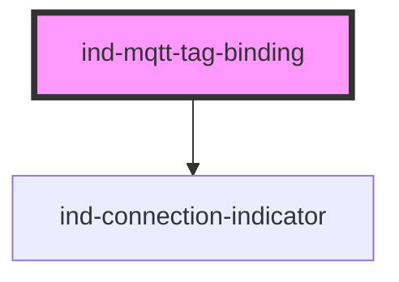

# ind-mqtt-tag-binding

<!-- Auto Generated Below -->

## Overview

Visualises the binding between an MQTT topic and a process value: topic,
last value, QoS, retain flag and the broker connection state.

## Properties

| Property             | Attribute  | Description                                 | Type                                                       | Default          |
| -------------------- | ---------- | ------------------------------------------- | ---------------------------------------------------------- | ---------------- |
| `label`              | `label`    | Friendly label (e.g. "Tank level").         | `string \| undefined`                                      | `undefined`      |
| `qos`                | `qos`      | Quality of Service level.                   | `0 \| 1 \| 2`                                              | `0`              |
| `retained`           | `retained` | Retained message flag.                      | `boolean`                                                  | `false`          |
| `state`              | `state`    | Broker connection state.                    | `"connected" \| "connecting" \| "disconnected" \| "error"` | `'disconnected'` |
| `topic` _(required)_ | `topic`    | MQTT topic (e.g. "plant/line2/tank/level"). | `string`                                                   | `undefined`      |
| `unit`               | `unit`     | Engineering unit.                           | `string \| undefined`                                      | `undefined`      |
| `value`              | `value`    | Last received value.                        | `number \| string \| undefined`                            | `undefined`      |

## Shadow Parts

| Part        | Description |
| ----------- | ----------- |
| `"flags"`   |             |
| `"label"`   |             |
| `"qos"`     |             |
| `"readout"` |             |
| `"retain"`  |             |
| `"topic"`   |             |
| `"value"`   |             |

## Dependencies

### Depends on

- [ind-connection-indicator](../../atoms/connection-indicator)

### Graph

----------------------------------------------

*Built with [StencilJS](https://stenciljs.com/)*
