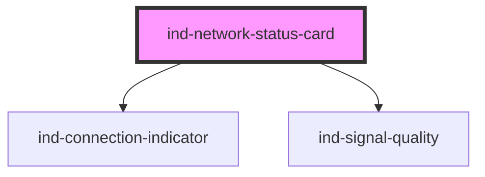

# ind-network-status-card

<!-- Auto Generated Below -->

## Overview

Network link summary: signal quality, address and throughput, with the
overall link state. Suits a wireless gateway or cellular modem panel.

## Properties

| Property  | Attribute | Description                       | Type                                                       | Default          |
| --------- | --------- | --------------------------------- | ---------------------------------------------------------- | ---------------- |
| `address` | `address` | IP / address.                     | `string \| undefined`                                      | `undefined`      |
| `label`   | `label`   | Link label (e.g. "Cellular WAN"). | `string`                                                   | `'Network'`      |
| `level`   | `level`   | Signal level 0–4 for the bars.    | `number`                                                   | `0`              |
| `rxKbps`  | `rx-kbps` | Downlink throughput (kbit/s).     | `number \| undefined`                                      | `undefined`      |
| `state`   | `state`   | Overall link state.               | `"connected" \| "connecting" \| "disconnected" \| "error"` | `'disconnected'` |
| `txKbps`  | `tx-kbps` | Uplink throughput (kbit/s).       | `number \| undefined`                                      | `undefined`      |

## Shadow Parts

| Part           | Description |
| -------------- | ----------- |
| `"address"`    |             |
| `"label"`      |             |
| `"signal"`     |             |
| `"throughput"` |             |

## Dependencies

### Depends on

- [ind-connection-indicator](../../atoms/connection-indicator)
- [ind-signal-quality](../../atoms/signal-quality)

### Graph

----------------------------------------------

*Built with [StencilJS](https://stenciljs.com/)*
