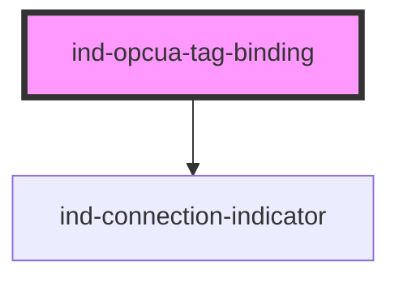

# ind-opcua-tag-binding

<!-- Auto Generated Below -->

## Overview

Visualises the binding to an OPC UA node: node id, last value, data quality
and the session connection state.

## Properties

| Property              | Attribute | Description                                           | Type                                                       | Default          |
| --------------------- | --------- | ----------------------------------------------------- | ---------------------------------------------------------- | ---------------- |
| `label`               | `label`   | Friendly label.                                       | `string \| undefined`                                      | `undefined`      |
| `nodeId` _(required)_ | `node-id` | OPC UA node id (e.g. "ns=2;s=Channel1.Device1.Tag1"). | `string`                                                   | `undefined`      |
| `quality`             | `quality` | OPC UA data quality.                                  | `"bad" \| "good" \| "uncertain"`                           | `'good'`         |
| `state`               | `state`   | Session connection state.                             | `"connected" \| "connecting" \| "disconnected" \| "error"` | `'disconnected'` |
| `unit`                | `unit`    | Engineering unit.                                     | `string \| undefined`                                      | `undefined`      |
| `value`               | `value`   | Last value.                                           | `number \| string \| undefined`                            | `undefined`      |

## Shadow Parts

| Part        | Description |
| ----------- | ----------- |
| `"label"`   |             |
| `"node-id"` |             |
| `"quality"` |             |
| `"readout"` |             |
| `"value"`   |             |

## Dependencies

### Depends on

- [ind-connection-indicator](../../atoms/connection-indicator)

### Graph

----------------------------------------------

*Built with [StencilJS](https://stenciljs.com/)*
