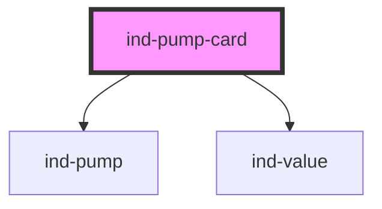

# ind-pump-card

<!-- Auto Generated Below -->

## Overview

Pump faceplate: animated `<ind-pump>` symbol plus flow / pressure readouts.

## Properties

| Property       | Attribute       | Description                                                           | Type                                                              | Default     |
| -------------- | --------------- | --------------------------------------------------------------------- | ----------------------------------------------------------------- | ----------- |
| `flow`         | `flow`          | Flow rate.                                                            | `number \| undefined`                                             | `undefined` |
| `flowUnit`     | `flow-unit`     | Flow unit (default m³/h).                                             | `string`                                                          | `'m³/h'`    |
| `label`        | `label`         | Human label (e.g. "Feed pump").                                       | `string \| undefined`                                             | `undefined` |
| `pressure`     | `pressure`      | Discharge pressure.                                                   | `number \| undefined`                                             | `undefined` |
| `pressureUnit` | `pressure-unit` | Pressure unit (default bar).                                          | `string`                                                          | `'bar'`     |
| `state`        | `state`         | Process state — `running` animates the impeller, drives fault chrome. | `"fault" \| "maintenance" \| "running" \| "stopped" \| "warning"` | `'stopped'` |
| `tag`          | `tag`           | Equipment tag (e.g. "P-101").                                         | `string \| undefined`                                             | `undefined` |

## Shadow Parts

| Part        | Description |
| ----------- | ----------- |
| `"body"`    |             |
| `"label"`   |             |
| `"metrics"` |             |
| `"tag"`     |             |

## Dependencies

### Depends on

- [ind-pump](../../atoms/pump)
- [ind-value](../../atoms/value)

### Graph

----------------------------------------------

*Built with [StencilJS](https://stenciljs.com/)*
