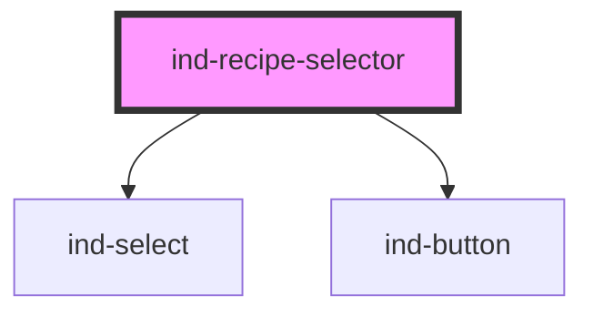

# ind-recipe-selector

<!-- Auto Generated Below -->

## Overview

Recipe / program picker: an `<ind-select>` plus a Load command. Emits
`indChange` as the selection changes and `indLoad` when the operator
commits the recipe to the controller.

## Properties

| Property      | Attribute     | Description                      | Type                  | Default            |
| ------------- | ------------- | -------------------------------- | --------------------- | ------------------ |
| `disabled`    | `disabled`    |                                  | `boolean`             | `false`            |
| `label`       | `label`       | Control label.                   | `string`              | `'Recipe'`         |
| `loadLabel`   | `load-label`  |                                  | `string`              | `'Load'`           |
| `options`     | --            | Available recipes.               | `SelectOption[]`      | `[]`               |
| `placeholder` | `placeholder` |                                  | `string`              | `'Select recipe…'` |
| `value`       | `value`       | Selected recipe value (two-way). | `string \| undefined` | `undefined`        |

## Events

| Event       | Description                                        | Type                  |
| ----------- | -------------------------------------------------- | --------------------- |
| `indChange` | Fires when the selection changes.                  | `CustomEvent<string>` |
| `indLoad`   | Fires when the operator loads the selected recipe. | `CustomEvent<string>` |

## Shadow Parts

| Part       | Description |
| ---------- | ----------- |
| `"label"`  |             |
| `"row"`    |             |
| `"select"` |             |

## Dependencies

### Depends on

- [ind-select](../../atoms/select)
- [ind-button](../../atoms/button)

### Graph

----------------------------------------------

*Built with [StencilJS](https://stenciljs.com/)*
