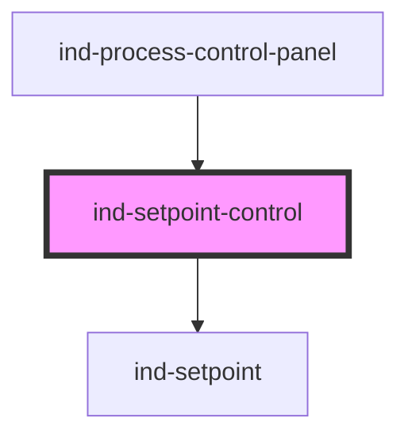

# ind-setpoint-control

<!-- Auto Generated Below -->

## Overview

Labelled setpoint faceplate. Wraps `<ind-setpoint>` (SP vs PV) with a title
and re-emits the committed value so a parent can write it to the controller.

## Properties

| Property             | Attribute   | Description                                  | Type                  | Default     |
| -------------------- | ----------- | -------------------------------------------- | --------------------- | ----------- |
| `disabled`           | `disabled`  |                                              | `boolean`             | `false`     |
| `label` _(required)_ | `label`     | Control name (e.g. "Discharge pressure SP"). | `string`              | `undefined` |
| `max`                | `max`       |                                              | `number`              | `100`       |
| `min`                | `min`       |                                              | `number`              | `0`         |
| `precision`          | `precision` |                                              | `number`              | `1`         |
| `pv`                 | `pv`        | Live process value for comparison.           | `number \| undefined` | `undefined` |
| `step`               | `step`      |                                              | `number`              | `1`         |
| `tag`                | `tag`       | Tag of the loop (e.g. "PIC-101").            | `string \| undefined` | `undefined` |
| `unit`               | `unit`      | Engineering unit.                            | `string \| undefined` | `undefined` |
| `value`              | `value`     | Target setpoint (two-way).                   | `number`              | `0`         |

## Events

| Event       | Description                                                     | Type                  |
| ----------- | --------------------------------------------------------------- | --------------------- |
| `indChange` | Fires with the new setpoint when the operator commits a change. | `CustomEvent<number>` |

## Shadow Parts

| Part         | Description |
| ------------ | ----------- |
| `"label"`    |             |
| `"setpoint"` |             |
| `"tag"`      |             |

## Dependencies

### Used by

 - [ind-process-control-panel](../../organisms/process-control-panel)

### Depends on

- [ind-setpoint](../../atoms/setpoint)

### Graph

----------------------------------------------

*Built with [StencilJS](https://stenciljs.com/)*
