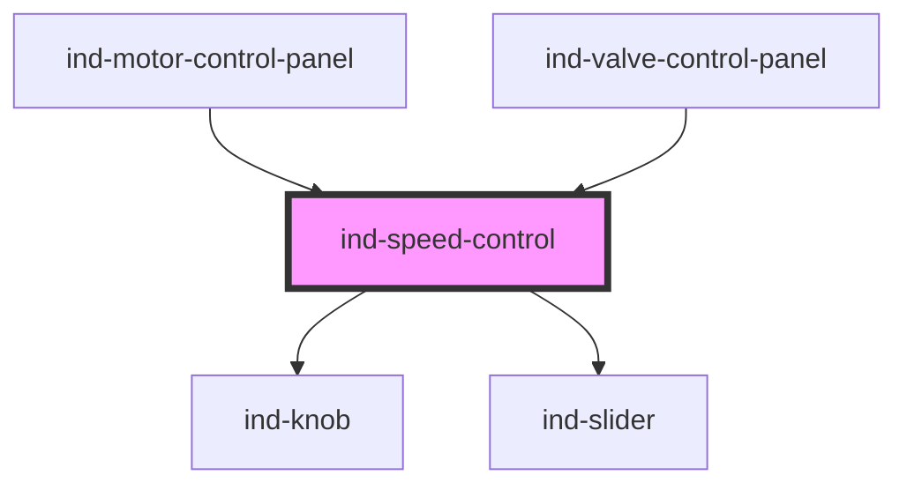

# ind-speed-control

<!-- Auto Generated Below -->

## Overview

Speed / rate control. Renders a slider (default) or knob for the operator to
set a percentage or engineering speed, and re-emits live + committed values.

## Properties

| Property             | Attribute  | Description                           | Type                 | Default     |
| -------------------- | ---------- | ------------------------------------- | -------------------- | ----------- |
| `disabled`           | `disabled` |                                       | `boolean`            | `false`     |
| `label` _(required)_ | `label`    | Control name (e.g. "Conveyor speed"). | `string`             | `undefined` |
| `max`                | `max`      |                                       | `number`             | `100`       |
| `min`                | `min`      |                                       | `number`             | `0`         |
| `step`               | `step`     |                                       | `number`             | `1`         |
| `unit`               | `unit`     | Unit (default %).                     | `string`             | `'%'`       |
| `value`              | `value`    | Current value (two-way).              | `number`             | `0`         |
| `variant`            | `variant`  | Input widget.                         | `"knob" \| "slider"` | `'slider'`  |

## Events

| Event       | Description                | Type                  |
| ----------- | -------------------------- | --------------------- |
| `indChange` | Committed value.           | `CustomEvent<number>` |
| `indInput`  | Live value while dragging. | `CustomEvent<number>` |

## Shadow Parts

| Part        | Description |
| ----------- | ----------- |
| `"control"` |             |
| `"label"`   |             |

## Dependencies

### Used by

 - [ind-motor-control-panel](../../organisms/motor-control-panel)
 - [ind-valve-control-panel](../../organisms/valve-control-panel)

### Depends on

- [ind-knob](../../atoms/knob)
- [ind-slider](../../atoms/slider)

### Graph

----------------------------------------------

*Built with [StencilJS](https://stenciljs.com/)*
