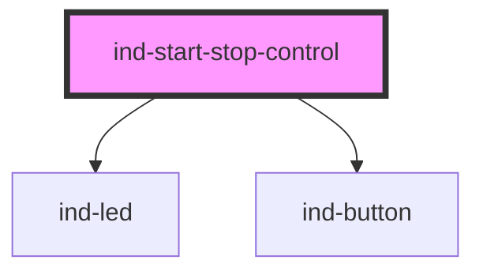

# ind-start-stop-control

<!-- Auto Generated Below -->

## Overview

Start / stop command pair with a running LED. Emits discrete `indStart` /
`indStop` events; the parent owns the command logic and reflects state back.

## Properties

| Property        | Attribute          | Description                                                           | Type                                                            | Default     |
| --------------- | ------------------ | --------------------------------------------------------------------- | --------------------------------------------------------------- | ----------- |
| `disabled`      | `disabled`         | Disable both commands.                                                | `boolean`                                                       | `false`     |
| `holdToStartMs` | `hold-to-start-ms` | Require a press-and-hold (ms) on Start to avoid accidental starts.    | `number \| undefined`                                           | `undefined` |
| `label`         | `label`            | Equipment label.                                                      | `string \| undefined`                                           | `undefined` |
| `startLabel`    | `start-label`      |                                                                       | `string`                                                        | `'Start'`   |
| `state`         | `state`            | Current run state — drives the LED and disables the redundant button. | `"fault" \| "running" \| "starting" \| "stopped" \| "stopping"` | `'stopped'` |
| `stopLabel`     | `stop-label`       |                                                                       | `string`                                                        | `'Stop'`    |

## Events

| Event      | Description                    | Type                |
| ---------- | ------------------------------ | ------------------- |
| `indStart` | Fires when Start is activated. | `CustomEvent<void>` |
| `indStop`  | Fires when Stop is activated.  | `CustomEvent<void>` |

## Shadow Parts

| Part        | Description |
| ----------- | ----------- |
| `"buttons"` |             |
| `"head"`    |             |
| `"label"`   |             |

## Dependencies

### Depends on

- [ind-led](../../atoms/led)
- [ind-button](../../atoms/button)

### Graph

----------------------------------------------

*Built with [StencilJS](https://stenciljs.com/)*
