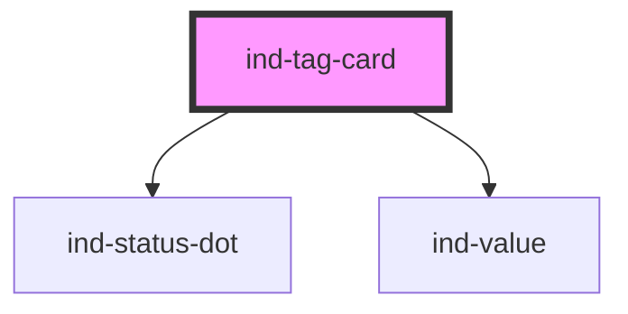

# ind-tag-card

<!-- Auto Generated Below -->

## Overview

Compact card for a single process tag: identifier + live value + status dot.
The atom of any tag wall / faceplate grid.

## Properties

| Property             | Attribute   | Description                                    | Type                                                                           | Default     |
| -------------------- | ----------- | ---------------------------------------------- | ------------------------------------------------------------------------------ | ----------- |
| `alarm`              | `alarm`     | Active alarm priority — tints the readout.     | `"high" \| "high-high" \| "low" \| "low-low" \| "none"`                        | `'none'`    |
| `label`              | `label`     | Human description (e.g. "Discharge pressure"). | `string \| undefined`                                                          | `undefined` |
| `precision`          | `precision` | Decimal places when numeric.                   | `number \| undefined`                                                          | `undefined` |
| `state`              | `state`     | Equipment / comms status shown by the dot.     | `"fault" \| "maintenance" \| "neutral" \| "running" \| "stopped" \| "warning"` | `'running'` |
| `tag` _(required)_   | `tag`       | Process tag (e.g. "PT-101").                   | `string`                                                                       | `undefined` |
| `trend`              | `trend`     | Process trend direction.                       | `"down" \| "none" \| "stable" \| "up"`                                         | `'none'`    |
| `unit`               | `unit`      | Engineering unit.                              | `string \| undefined`                                                          | `undefined` |
| `value` _(required)_ | `value`     | Current value.                                 | `number \| string`                                                             | `undefined` |

## Shadow Parts

| Part      | Description |
| --------- | ----------- |
| `"tag"`   |             |
| `"value"` |             |

## Dependencies

### Depends on

- [ind-status-dot](../../atoms/status-dot)
- [ind-value](../../atoms/value)

### Graph

----------------------------------------------

*Built with [StencilJS](https://stenciljs.com/)*
