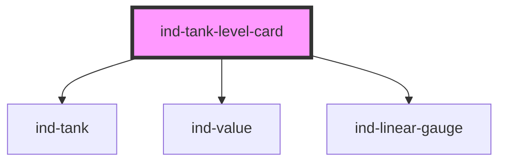

# ind-tank-level-card

<!-- Auto Generated Below -->

## Overview

Tank level faceplate: `<ind-tank>` symbol with a level readout and a
`<ind-linear-gauge>` showing the fill against low/high alarm bands.

## Properties

| Property   | Attribute  | Description                                                 | Type                                                              | Default     |
| ---------- | ---------- | ----------------------------------------------------------- | ----------------------------------------------------------------- | ----------- |
| `alarm`    | `alarm`    | Alarm tint of the liquid.                                   | `"high" \| "low" \| "none"`                                       | `'none'`    |
| `capacity` | `capacity` | Engineering capacity for the secondary readout (e.g. 5000). | `number \| undefined`                                             | `undefined` |
| `label`    | `label`    | Human label (e.g. "Buffer tank").                           | `string \| undefined`                                             | `undefined` |
| `level`    | `level`    | Current level 0–100 %.                                      | `number`                                                          | `0`         |
| `state`    | `state`    | Equipment state (drives fault chrome and tank outline).     | `"fault" \| "maintenance" \| "running" \| "stopped" \| "warning"` | `'running'` |
| `tag`      | `tag`      | Equipment tag (e.g. "T-204").                               | `string \| undefined`                                             | `undefined` |
| `unit`     | `unit`     | Capacity unit (e.g. "L").                                   | `string`                                                          | `'L'`       |

## Shadow Parts

| Part        | Description |
| ----------- | ----------- |
| `"body"`    |             |
| `"gauge"`   |             |
| `"label"`   |             |
| `"metrics"` |             |
| `"tag"`     |             |

## Dependencies

### Depends on

- [ind-tank](../../atoms/tank)
- [ind-value](../../atoms/value)
- [ind-linear-gauge](../../atoms/linear-gauge)

### Graph

----------------------------------------------

*Built with [StencilJS](https://stenciljs.com/)*
