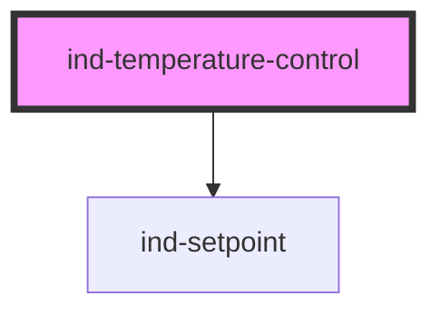

# ind-temperature-control

<!-- Auto Generated Below -->

## Overview

Temperature loop faceplate: setpoint vs process value plus a heating/cooling
indicator. Re-emits the committed setpoint.

## Properties

| Property             | Attribute   | Description                                    | Type                               | Default     |
| -------------------- | ----------- | ---------------------------------------------- | ---------------------------------- | ----------- |
| `disabled`           | `disabled`  |                                                | `boolean`                          | `false`     |
| `label` _(required)_ | `label`     | Loop label (e.g. "Reactor jacket").            | `string`                           | `undefined` |
| `max`                | `max`       |                                                | `number`                           | `200`       |
| `min`                | `min`       |                                                | `number`                           | `0`         |
| `mode`               | `mode`      | Current thermal action — drives the indicator. | `"cooling" \| "heating" \| "idle"` | `'idle'`    |
| `precision`          | `precision` |                                                | `number`                           | `1`         |
| `pv`                 | `pv`        | Live process temperature.                      | `number \| undefined`              | `undefined` |
| `step`               | `step`      |                                                | `number`                           | `0.5`       |
| `tag`                | `tag`       | Loop tag (e.g. "TIC-301").                     | `string \| undefined`              | `undefined` |
| `unit`               | `unit`      | Temperature unit (default °C).                 | `string`                           | `'°C'`      |
| `value`              | `value`     | Target temperature (two-way).                  | `number`                           | `20`        |

## Events

| Event       | Description         | Type                  |
| ----------- | ------------------- | --------------------- |
| `indChange` | Committed setpoint. | `CustomEvent<number>` |

## Shadow Parts

| Part         | Description |
| ------------ | ----------- |
| `"label"`    |             |
| `"mode"`     |             |
| `"setpoint"` |             |
| `"tag"`      |             |

## Dependencies

### Depends on

- [ind-setpoint](../../atoms/setpoint)

### Graph

----------------------------------------------

*Built with [StencilJS](https://stenciljs.com/)*
