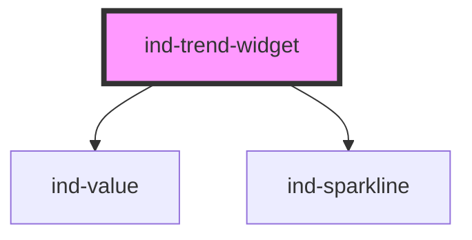

# ind-trend-widget

<!-- Auto Generated Below -->

## Overview

Compact trend widget: current value, an `<ind-sparkline>` of the recent
window, and min/max bounds. For dense dashboards where a full trend chart is
too heavy.

## Properties

| Property             | Attribute   | Description                                 | Type                                             | Default     |
| -------------------- | ----------- | ------------------------------------------- | ------------------------------------------------ | ----------- |
| `label` _(required)_ | `label`     | Series label (e.g. "Discharge pressure").   | `string`                                         | `undefined` |
| `max`                | `max`       | Sparkline upper bound (auto if omitted).    | `number \| undefined`                            | `undefined` |
| `min`                | `min`       | Sparkline lower bound (auto if omitted).    | `number \| undefined`                            | `undefined` |
| `points`             | --          | Recent samples.                             | `number[]`                                       | `[]`        |
| `precision`          | `precision` | Decimal places.                             | `number`                                         | `1`         |
| `tag`                | `tag`       | Process tag.                                | `string \| undefined`                            | `undefined` |
| `unit`               | `unit`      | Engineering unit.                           | `string \| undefined`                            | `undefined` |
| `value`              | `value`     | Current value (defaults to the last point). | `number \| undefined`                            | `undefined` |
| `variant`            | `variant`   | Sparkline color variant.                    | `"default" \| "fault" \| "running" \| "warning"` | `'default'` |

## Shadow Parts

| Part       | Description |
| ---------- | ----------- |
| `"bounds"` |             |
| `"label"`  |             |
| `"spark"`  |             |
| `"tag"`    |             |
| `"value"`  |             |

## Dependencies

### Depends on

- [ind-value](../../atoms/value)
- [ind-sparkline](../../atoms/sparkline)

### Graph

----------------------------------------------

*Built with [StencilJS](https://stenciljs.com/)*
