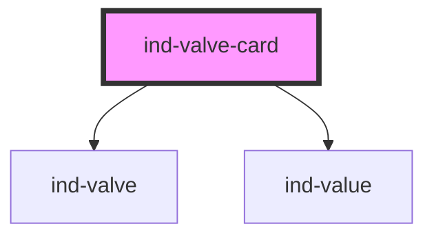

# ind-valve-card

<!-- Auto Generated Below -->

## Overview

Valve faceplate: ISA `<ind-valve>` symbol plus open/closed state and an
optional position (%) for modulating valves.

## Properties

| Property   | Attribute  | Description                                          | Type                                         | Default     |
| ---------- | ---------- | ---------------------------------------------------- | -------------------------------------------- | ----------- |
| `label`    | `label`    | Human label (e.g. "Discharge valve").                | `string \| undefined`                        | `undefined` |
| `position` | `position` | Modulating position 0–100 %. Omit for on/off valves. | `number \| undefined`                        | `undefined` |
| `state`    | `state`    | Valve state — drives the symbol and fault chrome.    | `"closed" \| "fault" \| "open" \| "transit"` | `'closed'`  |
| `tag`      | `tag`      | Equipment tag (e.g. "FV-12").                        | `string \| undefined`                        | `undefined` |

## Shadow Parts

| Part            | Description |
| --------------- | ----------- |
| `"body"`        |             |
| `"label"`       |             |
| `"metrics"`     |             |
| `"state-label"` |             |
| `"tag"`         |             |

## Dependencies

### Depends on

- [ind-valve](../../atoms/valve)
- [ind-value](../../atoms/value)

### Graph

----------------------------------------------

*Built with [StencilJS](https://stenciljs.com/)*
