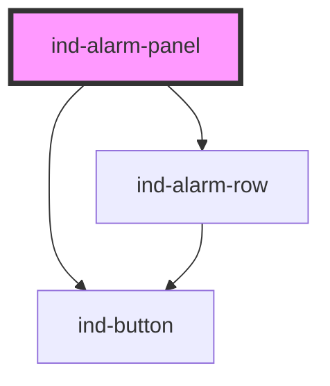

# ind-alarm-panel

<!-- Auto Generated Below -->

## Overview

Active alarm list with a toolbar: shows unacknowledged-first, ISA-18.2
sorted `<ind-alarm-row>`s and an "ACK all" command. Emits `indAck` (per
alarm) and `indAckAll`.

## Properties

| Property           | Attribute           | Description                       | Type               | Default    |
| ------------------ | ------------------- | --------------------------------- | ------------------ | ---------- |
| `alarms`           | --                  | Alarm rows.                       | `AlarmPanelItem[]` | `[]`       |
| `heading`          | `heading`           | Panel heading.                    | `string`           | `'Alarms'` |
| `hideAcknowledged` | `hide-acknowledged` | Hide already-acknowledged alarms. | `boolean`          | `false`    |

## Events

| Event       | Description                                                  | Type                  |
| ----------- | ------------------------------------------------------------ | --------------------- |
| `indAck`    | Fires with the alarm id when a single alarm is acknowledged. | `CustomEvent<string>` |
| `indAckAll` | Fires when the operator acknowledges all visible alarms.     | `CustomEvent<void>`   |

## Shadow Parts

| Part        | Description |
| ----------- | ----------- |
| `"heading"` |             |
| `"list"`    |             |

## Dependencies

### Depends on

- [ind-button](../../atoms/button)
- [ind-alarm-row](../../molecules/alarm-row)

### Graph

----------------------------------------------

*Built with [StencilJS](https://stenciljs.com/)*
