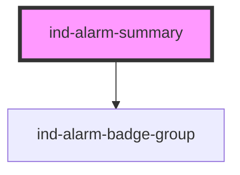

# ind-alarm-summary

<!-- Auto Generated Below -->

## Overview

Compact alarm KPI block: total + unacknowledged headline figures and the
ISA-18.2 priority breakdown via `<ind-alarm-badge-group>`. For a dashboard
tile or the top of an alarm page.

## Properties

| Property         | Attribute        | Description                             | Type     | Default           |
| ---------------- | ---------------- | --------------------------------------- | -------- | ----------------- |
| `heading`        | `heading`        |                                         | `string` | `'Alarm summary'` |
| `high`           | `high`           |                                         | `number` | `0`               |
| `highHigh`       | `high-high`      |                                         | `number` | `0`               |
| `low`            | `low`            |                                         | `number` | `0`               |
| `lowLow`         | `low-low`        |                                         | `number` | `0`               |
| `unacknowledged` | `unacknowledged` | Number still requiring acknowledgement. | `number` | `0`               |

## Shadow Parts

| Part        | Description |
| ----------- | ----------- |
| `"badges"`  |             |
| `"figures"` |             |
| `"heading"` |             |
| `"total"`   |             |
| `"unacked"` |             |

## Dependencies

### Depends on

- [ind-alarm-badge-group](../../molecules/alarm-badge-group)

### Graph

----------------------------------------------

*Built with [StencilJS](https://stenciljs.com/)*
