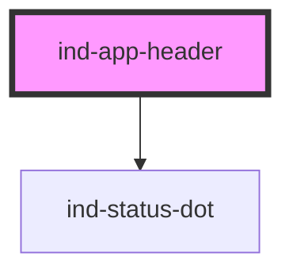

# ind-app-header

<!-- Auto Generated Below -->

## Properties

| Property             | Attribute             | Description                                          | Type                                                                           | Default     |
| -------------------- | --------------------- | ---------------------------------------------------- | ------------------------------------------------------------------------------ | ----------- |
| `brand` _(required)_ | `brand`               | Brand name (uppercase by convention).                | `string`                                                                       | `undefined` |
| `docsUrl`            | `docs-url`            | Documentation URL.                                   | `string \| undefined`                                                          | `undefined` |
| `hideChangeMachine`  | `hide-change-machine` | Hide the built-in "Change machine" button.           | `boolean`                                                                      | `false`     |
| `hideDisconnect`     | `hide-disconnect`     | Hide the built-in "Disconnect" button.               | `boolean`                                                                      | `false`     |
| `machineId`          | `machine-id`          | Machine identifier shown next to the brand.          | `string \| undefined`                                                          | `undefined` |
| `mqttLabel`          | `mqtt-label`          | Label rendered next to the dot (e.g. "Connected").   | `string \| undefined`                                                          | `undefined` |
| `mqttState`          | `mqtt-state`          | Broker / realtime connection state — drives the dot. | `"fault" \| "maintenance" \| "neutral" \| "running" \| "stopped" \| "warning"` | `'neutral'` |
| `subBrand`           | `sub-brand`           | Sub-brand line (e.g. "Maintenance Console").         | `string \| undefined`                                                          | `undefined` |
| `version`            | `version`             | App version (e.g. "v1.4.2").                         | `string \| undefined`                                                          | `undefined` |

## Events

| Event              | Description | Type                |
| ------------------ | ----------- | ------------------- |
| `indChangeMachine` |             | `CustomEvent<void>` |
| `indDisconnect`    |             | `CustomEvent<void>` |

## Shadow Parts

| Part        | Description |
| ----------- | ----------- |
| `"actions"` |             |
| `"brand"`   |             |
| `"machine"` |             |
| `"meta"`    |             |
| `"mqtt"`    |             |

## Dependencies

### Depends on

- [ind-status-dot](../../atoms/status-dot)

### Graph

----------------------------------------------

*Built with [StencilJS](https://stenciljs.com/)*
