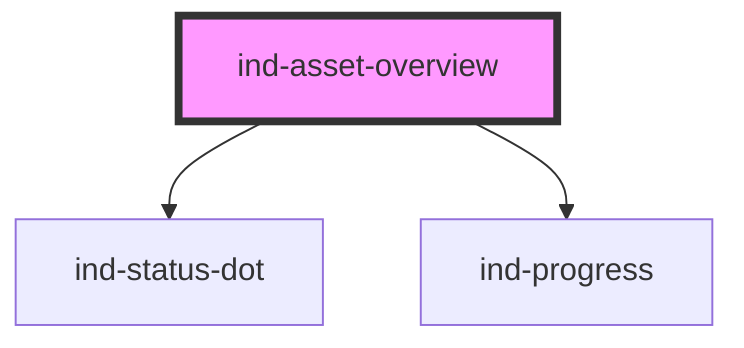

# ind-asset-overview

<!-- Auto Generated Below -->

## Overview

Tabular overview of plant assets with state dot, health bar and detail.
Suits an asset register or a fleet health page.

## Properties

| Property  | Attribute | Description | Type          | Default    |
| --------- | --------- | ----------- | ------------- | ---------- |
| `assets`  | --        |             | `AssetItem[]` | `[]`       |
| `heading` | `heading` |             | `string`      | `'Assets'` |

## Shadow Parts

| Part        | Description |
| ----------- | ----------- |
| `"detail"`  |             |
| `"heading"` |             |
| `"list"`    |             |
| `"name"`    |             |
| `"row"`     |             |
| `"tag"`     |             |

## Dependencies

### Depends on

- [ind-status-dot](../../atoms/status-dot)
- [ind-progress](../../atoms/progress)

### Graph

----------------------------------------------

*Built with [StencilJS](https://stenciljs.com/)*
