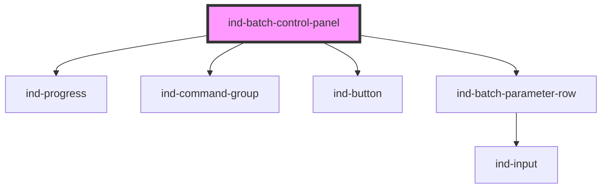

# ind-batch-control-panel

<!-- Auto Generated Below -->

## Overview

Batch / phase control panel: current phase + progress, Start / Hold / Stop
commands and the active parameter set.

## Properties

| Property     | Attribute  | Description                     | Type                                                     | Default           |
| ------------ | ---------- | ------------------------------- | -------------------------------------------------------- | ----------------- |
| `batchId`    | `batch-id` | Batch / lot identifier.         | `string \| undefined`                                    | `undefined`       |
| `heading`    | `heading`  |                                 | `string`                                                 | `'Batch control'` |
| `parameters` | --         | Active parameters.              | `BatchParam[]`                                           | `[]`              |
| `phase`      | `phase`    | Current phase / step name.      | `string \| undefined`                                    | `undefined`       |
| `progress`   | `progress` | Phase progress 0–100 %.         | `number`                                                 | `0`               |
| `state`      | `state`    | Batch state — drives the badge. | `"complete" \| "fault" \| "held" \| "idle" \| "running"` | `'idle'`          |

## Events

| Event      | Description | Type                |
| ---------- | ----------- | ------------------- |
| `indHold`  |             | `CustomEvent<void>` |
| `indStart` |             | `CustomEvent<void>` |
| `indStop`  |             | `CustomEvent<void>` |

## Shadow Parts

| Part        | Description |
| ----------- | ----------- |
| `"heading"` |             |
| `"params"`  |             |
| `"phase"`   |             |
| `"state"`   |             |

## Dependencies

### Depends on

- [ind-progress](../../atoms/progress)
- [ind-command-group](../../molecules/command-group)
- [ind-button](../../atoms/button)
- [ind-batch-parameter-row](../../molecules/batch-parameter-row)

### Graph

----------------------------------------------

*Built with [StencilJS](https://stenciljs.com/)*
